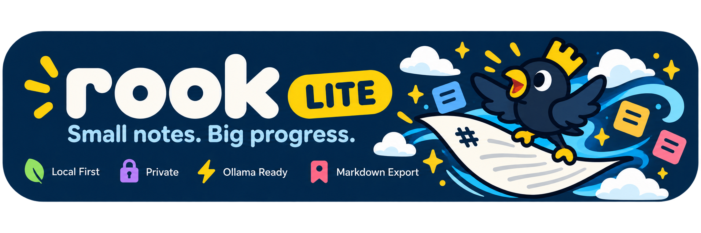

# Rook Lite

Rook Lite is a private, local-first personal daily notes and summary application. It runs entirely in the browser as a client-side Single Page Application (SPA), storing notes, categories, drafts, and summaries in **IndexedDB** on your machine.

There are no remote databases, cloud sync servers, telemetry, or hosted AI backends. Notes stay on your device unless you explicitly export or back them up.

---

## Architecture Overview

```
┌────────────────────────────────────────────────────────┐
│                      Rook Lite UI                      │
│        (Vite + TypeScript + Vanilla CSS Design Tokens) │
└───────┬────────────────────────┬───────────────┬───────┘
        │                        │               │
        ▼                        ▼               ▼
┌───────────────┐        ┌───────────────┐ ┌─────────────┐
│  IndexedDB    │        │ Summarization │ │ Export /    │
│  (idb)        │        │ Engine        │ │ Backup      │
├───────────────┤        ├───────────────┤ ├─────────────┤
│ • notes       │        │ • Rule-based  │ │ • JSON v1   │
│ • categories  │        │   (offline)   │ │ • Markdown  │
│ • summaries   │        │ • Local Ollama│ │   ZIP       │
│ • settings    │        │   (loopback)  │ │ • Directory │
│ • drafts      │        └───────────────┘ │   API       │
└───────────────┘                          └─────────────┘
```

- **Runtime & Tooling:** [Vite 7](https://vitejs.dev/) with [TypeScript 5](https://www.typescriptlang.org/) in strict mode.
- **Client Storage:** [IndexedDB via `idb`](https://github.com/jakearchibald/idb) (`rook-lite-db` database) with structured object stores and schema versioning.
- **Routing:** Custom subpath-aware client router (`routing.ts`) supporting root domains and repository subdirectories (e.g., GitHub Pages) with clean URLs.
- **Summarization:** Dual-engine architecture (`summaries.ts`):
  1. **Rule-Based Engine:** Deterministic, offline summary generation grouped by category and task status.
  2. **Local Ollama LLM:** Connects directly to local Ollama instances (`http://localhost:11434`) with strict loopback validation, model discovery, and automatic fallback.
- **Markdown & Security:** Parsed via [Marked](https://marked.js.org/) and sanitized through [DOMPurify](https://github.com/cure53/DOMPurify) with support for interactive task checkboxes.
- **Data Portability:** Zero lock-in. Full JSON backups, directory exports via the File System Access API, and zipped Markdown archives using [fflate](https://github.com/101arrowz/fflate).

---

## Local Development

### Prerequisites

- **Node.js:** `>= 20.x` (Node 22 LTS recommended)
- **npm:** `>= 10.x`
- **Ollama (Optional):** Required only if you want local LLM summarization.

### Setup & Run

1. **Clone the repository:**
   ```bash
   git clone https://github.com/volkanto/rook-lite.git
   cd rook-lite
   ```

2. **Install dependencies:**
   ```bash
   npm install
   ```

3. **Start the local development server:**
   ```bash
   npm run dev
   ```
   Open [http://localhost:5173](http://localhost:5173) in your browser. Vite provides instant Hot Module Replacement (HMR).

---

## Local AI with Ollama

Rook Lite can use a local Ollama instance running on your machine to summarize your daily notes without sending text to any external cloud API.

### 1. Start Ollama Locally

If Ollama is installed on your machine, start the server:

```bash
# Allow browser requests from your local frontend origin
OLLAMA_ORIGINS="http://localhost:5173,http://localhost:8080" ollama serve
```

> **Note on CORS:** Modern browsers enforce CORS on cross-origin `fetch` calls. Setting `OLLAMA_ORIGINS` allows the browser to connect to Ollama running on `http://localhost:11434`.

### 2. Pull a Recommended Model

```bash
ollama pull llama3.2:latest
# or
ollama pull mistral:latest
# or
ollama pull qwen2.5:latest
```

### 3. Configure in Rook Lite

Navigate to **Settings** (`/settings`):
1. Enable **Local Ollama Integration**.
2. Keep endpoint set to `http://localhost:11434` (endpoints are restricted strictly to loopback addresses `localhost`, `127.0.0.1`, and `[::1]`).
3. Click **Discover models** to test the connection and select an installed model.
4. If Ollama is unavailable, the application automatically falls back to offline rule-based summaries.

---

## Development Scripts

| Command | Description |
| :--- | :--- |
| `npm run dev` | Starts Vite dev server at `http://localhost:5173` with HMR |
| `npm run build` | Runs TypeScript compiler (`tsc`) and bundles production assets into `dist/` |
| `npm run preview` | Locally serves the production build from `dist/` |
| `npm run typecheck` | Checks TypeScript types without emitting files (`tsc --noEmit`) |
| `npm test` | Executes the Vitest automated test suite with JSDOM |

---

## Codebase Structure

```text
rook-lite/
├── rook-lite-banner.png      # Project header banner
├── index.html                # HTML entry point and theme bootstrap
├── package.json              # Dependencies and build scripts
├── tsconfig.json             # TypeScript compiler configuration
├── vite.config.ts            # Vite bundler configuration (subpath-aware)
├── Dockerfile                # Multi-stage production container build
├── nginx.conf                # Nginx SPA configuration and caching rules
├── public/                   # Static assets, logo, manifest, and service worker
└── src/
    ├── main.ts               # App entrypoint, shell UI, router loop, modal search
    ├── models.ts             # Core domain interfaces (Note, Category, Summary, Settings)
    ├── db.ts                 # IndexedDB initialization and data repositories
    ├── routing.ts            # Subpath-aware router, URL normalization, link interception
    ├── services.ts           # Business logic: notes, categories, tags, and tasks
    ├── summaries.ts          # Rule-based and Ollama summary engines & date periods
    ├── markdown.ts           # Marked parser configuration, task checkboxes, DOMPurify
    ├── data.ts               # JSON backup/restore, Markdown zip generator, Directory export
    ├── app.css               # Base layout, design system variables, and typography
    ├── lite.css              # Icon rail navigation, dark/light themes, modal overlays
    └── *.test.ts             # Vitest test suites (routing, services, summaries, data, nav)
```

---

## Running with Docker

You can package and run Rook Lite as a containerized static site using the provided multi-stage `Dockerfile`:

```bash
# Build the Docker image
docker build -t rook-lite .

# Run the container
docker run --rm -p 8080:8080 rook-lite
```

Open [http://localhost:8080](http://localhost:8080) in your browser.

- The multi-stage build compiles TypeScript and assets with Node Alpine, then serves the static bundle with Nginx Alpine.
- An integrated healthcheck verifies service readiness on port `8080`.
- All notes and settings reside in your browser's IndexedDB for the `http://localhost:8080` origin; the container itself is completely stateless.

---

## Testing & Quality Verification

Automated tests are written with [Vitest](https://vitest.dev/) in a JSDOM environment:

```bash
# Run all unit tests
npm test

# Run tests in watch mode
npx vitest

# Run tests with verbose output
npx vitest run --reporter=verbose
```

### Test Coverage Areas
- **`routing.test.ts`:** Base path prefixing, subpath isolation, idempotent link normalization.
- **`services.test.ts`:** Note and category CRUD, Markdown task state toggling, tag extraction.
- **`summaries.test.ts`:** ISO calendar period math, rule-based categorization, Ollama loopback security assertions.
- **`data.test.ts`:** V1 backup validation, schema round-trip integrity, export structure.
- **`navigation.test.ts`:** Navigation items, icon family verification, and theme toggle behavior.

---

## Deployment (GitHub Pages & Static Hosts)

Rook Lite is designed to run on any static hosting provider (GitHub Pages, Cloudflare Pages, Netlify, Vercel, or S3/CloudFront).

### Subpath Deployments

The application reads the base path dynamically from `process.env.VITE_BASE_PATH`:

```bash
VITE_BASE_PATH="/my-subpath/" npm run build
```

When deployed to GitHub Pages via `.github/workflows/pages.yml`, the workflow automatically sets the base path to match the repository name, ensuring relative assets and internal routes resolve correctly.

---

## License

Rook Lite is licensed under the [Apache License 2.0](./LICENSE).
